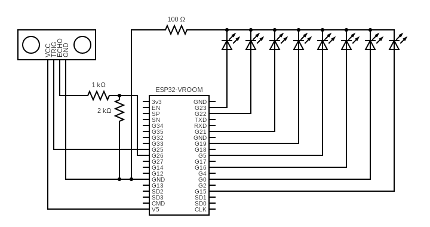
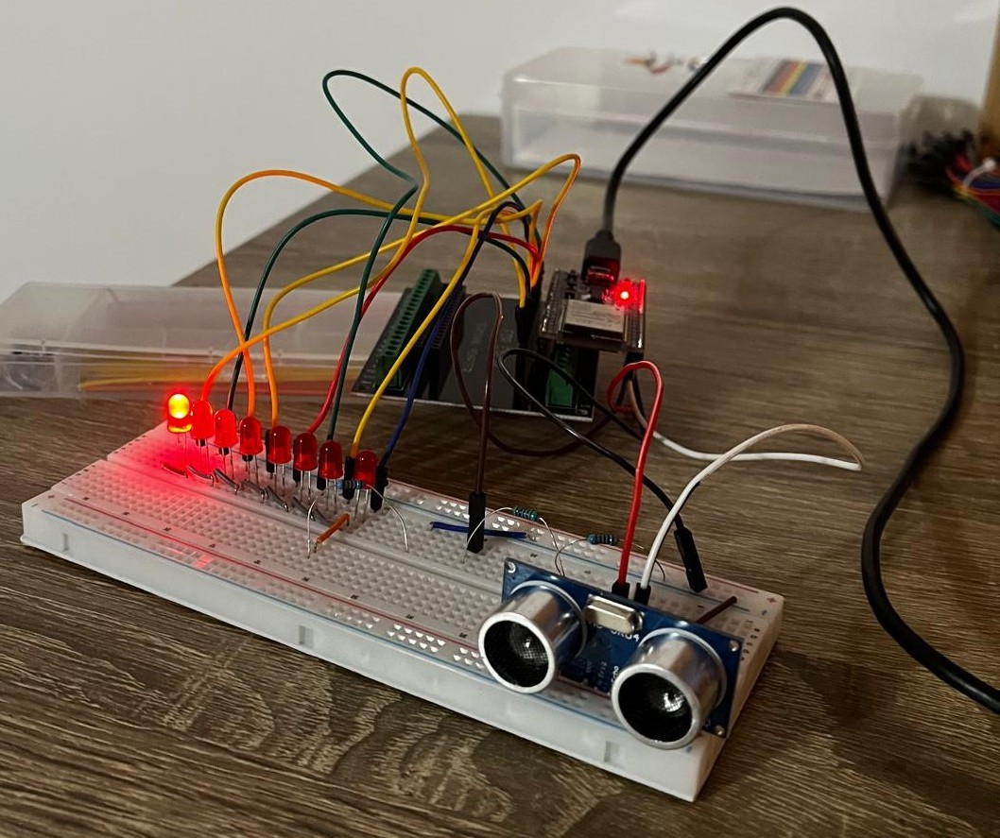

# ESP32 Interrupt-Driven Ultrasonic Controller

This project demonstrates a **non-blocking approach** to reading ultrasonic sensors (HC-SR04) and controlling LED sequences using the **ESP32 hardware architecture**.

Unlike standard implementations that rely on blocking functions like `delay()` or `pulseIn()`, this solution utilizes **Hardware Timers** and **ISRs (Interrupt Service Routines)** to maintain precise timing without freezing the CPU.

  
   
  <em>Figure 1: Hardware Schematic connecting ESP32, HC-SR04 and LED Array</em>

## 🚀 Key Features (Low-Level Logic)
* **Hardware Timer Interrupts:** Uses `hw_timer_t` to trigger ultrasonic pulses precisely every 33ms (~15Hz) without occupying the main loop.
* **GPIO Interrupts (ISR):** Captures ECHO signal changes (`IRAM_ATTR`) to calculate distance with microsecond precision.
* **Non-Blocking State Machine:** The LED sequence speed adapts dynamically to the distance, managed entirely through time-delta calculation (`millis()` and `micros()`), allowing the CPU to perform other tasks simultaneously.

## 🛠 Hardware Implementation
The prototype was built and tested using an **ESP32 Dev Kit V1**.

* **Microcontroller:** ESP32 Dev Kit
* **Sensor:** HC-SR04 Ultrasonic Sensor
* **Output:** 8x LEDs (Visualizing distance)

### Pinout Configuration
| Component | ESP32 Pin |
|-----------|-----------|
| Trigger   | GPIO 25   |
| Echo      | GPIO 26   |
| LED 1-8   | 15, 0, 16, 5, 19, 21, 22, 23 |

## 📸 Prototype Gallery

  
   
  <em>Figure 2: Physical implementation on breadboard proving real-time constraints handling.</em>

## 💻 Code Structure
The project avoids high-level abstractions to demonstrate understanding of system architecture:
* `onEchoChange()`: Handles the rising/falling edge of the sensor signal.
* `onTimer()`: Manages the Trigger signal activation.
* `loop()`: Processes the data and updates the visual state machine based on the calculated intervals.

## ⚙️ Setup & Requirements
* **IDE:** Arduino IDE (with ESP32 Board Manager installed) or PlatformIO.
* **Libraries:** No external libraries required (uses native ESP32 Hardware Abstraction Layer).

## 📝 Context
Developed within the scope of a **Computer Architecture** course to demonstrate proficiency in concurrency, interrupt handling, and resource optimization on embedded systems.